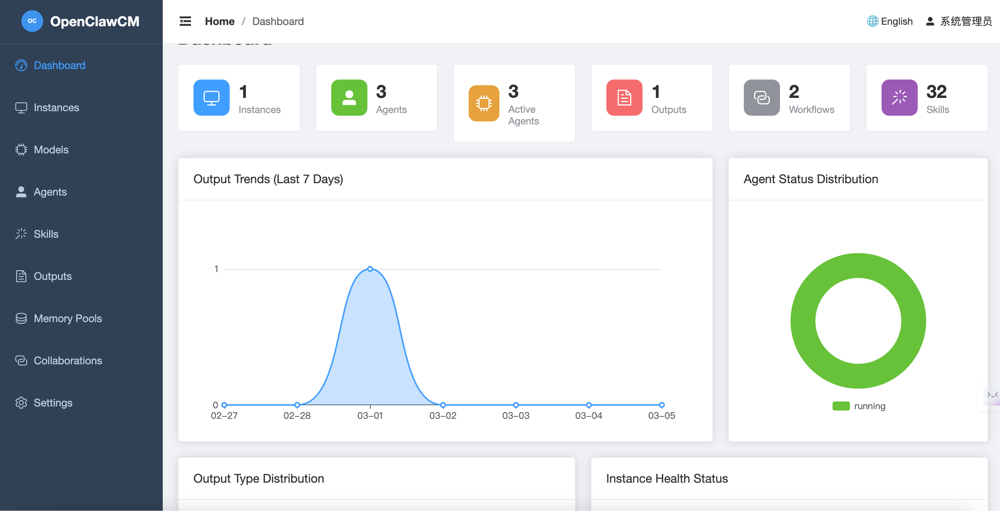

<p align="center">
  <h1 align="center">🐾 OpenClawCM</h1>
  <p align="center"><strong>Unified Management Platform for Multi-Instance AI Agents</strong></p>
  <p align="center">
    <a href="README_CN.md">中文</a> · <a href="docs/TECHNICAL.md">技术文档</a> · <a href="docs/TECHNICAL_EN.md">Technical Docs</a>
  </p>
</p>

---

## The Problem & Our Vision

When your organization runs dozens of OpenClaw instances with hundreds of AI Agents, you inevitably face:

- **Siloed Management** — Each instance operates in isolation with no global visibility
- **Collaboration Black Box** — Multi-agent workflows rely on hand-written JSON routing rules, making debugging painful
- **Scattered Outputs** — Code, documents, and logs are spread across nodes with no unified retrieval
- **Fragmented Memory** — Agent context histories are isolated; cross-agent knowledge cannot be shared

**OpenClawCM** is purpose-built to solve these challenges. It provides a **centralized web console** where you can onboard instances, orchestrate agents, visually design collaboration workflows, manage outputs with full-text search, and enable cross-agent knowledge reuse through shared memory pools — all from a single interface.

---

## Core Capabilities

| Capability | Description |
|------------|-------------|
| **Instance Management** | Centralized registration, grouping, and health probing for multiple OpenClaw instances |
| **Agent Lifecycle** | Create → Configure model/prompt → Bind skills → Start/Stop control |
| **Visual Flow Editor** | Drag-and-drop DAG editor powered by Vue Flow with 5 node types |
| **Shared Memory Pools** | Cross-agent shared context with read/write/readonly permission control |
| **Unified Output Hub** | 7 output types + FTS5 full-text search + syntax highlighting + Markdown rendering |
| **Model Provider Management** | Multi-LLM provider support, global/instance/agent-level model configuration |
| **Audit & Security** | JWT authentication, 3-tier RBAC, automatic audit logging for all write operations |

---

## Architecture

```
┌──────────────────────────────────────────────────────────┐
│                    Nginx (Port 80)                        │
│         SPA Static Assets  │  /api/ Reverse Proxy         │
└──────────┬─────────────────┴─────────┬───────────────────┘
           │                           │
┌──────────▼──────────┐   ┌────────────▼──────────────────┐
│   Vue 3 Frontend    │   │      FastAPI Backend          │
│  Element Plus UI    │   │  SQLAlchemy Async ORM         │
│  Vue Flow Editor    │   │  JWT Auth + RBAC              │
│  Pinia State Mgmt   │   │  Audit Middleware             │
└─────────────────────┘   └────────────┬──────────────────┘
                                       │
                          ┌────────────▼──────────────────┐
                          │   SQLite (FTS5) / MySQL       │
                          │   17 Tables + FTS Index        │
                          └───────────────────────────────┘
```

---

## Quick Start

### Docker Compose (Recommended)

```bash
git clone https://github.com/your-org/openclawcm.git
cd openclawcm

# Adjust environment variables if needed
# vim docker-compose.yml

docker compose up -d
```

Visit **http://localhost** — default credentials: `admin / admin123`.

### Local Development

```bash
# Backend
cd backend
python -m venv venv && source venv/bin/activate
pip install -r requirements.txt
uvicorn app.main:app --host 0.0.0.0 --port 8000 --reload

# Frontend (new terminal)
cd frontend
npm install
npm run dev
```

Frontend: http://localhost:5173 — Backend API: http://localhost:8000

---

## Project Structure

```
openclawcm/
├── backend/
│   ├── app/
│   │   ├── main.py              # FastAPI entrypoint + startup events
│   │   ├── config.py            # Environment config (.env)
│   │   ├── database.py          # Async DB engine + FTS5 setup
│   │   ├── models/              # 15 ORM models
│   │   ├── schemas/             # Pydantic request/response models
│   │   ├── api/v1/              # 10 router modules (89 endpoints)
│   │   ├── middleware/          # Audit logging middleware
│   │   └── utils/               # Response helpers + auth utilities
│   ├── requirements.txt
│   └── Dockerfile
├── frontend/
│   ├── src/
│   │   ├── api/index.js         # Axios API layer (90 methods)
│   │   ├── router/index.js      # 11 routes
│   │   ├── views/               # 10 page views
│   │   ├── layouts/             # Main layout (sidebar + header)
│   │   └── stores/              # Pinia state
│   ├── package.json
│   └── Dockerfile
├── tests/
│   └── integration_test.sh      # 85 integration tests
├── docker-compose.yml
└── nginx.conf
```

---

## Feature Modules

### 📊 Dashboard

Real-time monitoring with ECharts visualizations:



- 6 statistics cards (instances / agents / active agents / outputs / collaborations / skills)
- Output trends line chart (last 7 days)
- Agent status distribution pie chart
- Output type distribution bar chart
- Instance health ring chart
- Recent output timeline and system alert list

### 🖥️ Instance Management

Register multiple OpenClaw instances with grouping, API key storage, automatic heartbeat detection, last heartbeat timestamp display, and 30-second auto-refresh polling.

### 🤖 Agent Management

Full agent lifecycle management including:
- Basic info and system prompt configuration
- Model binding (LLM Provider → Model Config → Agent)
- Memory configuration (type / history limit / token limit / persistence / auto-cleanup)
- Skill binding/unbinding
- One-click start/stop

### 🔗 Collaboration Flow Editor

Drag-and-drop DAG visual editor supporting:
- **5 node types**: Start, End, Agent, Condition Branch, Parallel Gateway
- Edge connections with conditional routing
- Real-time property editing panel
- Auto-save layout (node coordinates + viewport state)
- Save as reusable template

### 📝 Output Management

Unified collection of 7 output types (CODE / DOCUMENT / LOG / REPORT / DATA / IMAGE / OTHER):
- FTS5 full-text search
- Code syntax highlighting (highlight.js, github-dark theme)
- Live Markdown rendering
- Favorites, tags, single/batch export, batch delete

### 🧠 Shared Memory Pools

Create cross-agent shared memory spaces supporting:
- Multiple memory types (buffer / summary / token_buffer)
- Agent binding with permission control (read / write / readwrite)
- Association with collaboration flows

### 🔧 Model Management

Two-tier structure: Provider (OpenAI / Anthropic / custom) → Model Config (temperature / max_tokens / top_p), with global/instance/agent scope support.

### 🔐 System Administration

- JWT authentication (24h expiry)
- RBAC roles (admin / operator / viewer) with route-level enforcement
- All API routes protected by `require_auth` dependency (except login)
- Frontend role-based route guards (Settings page admin-only)
- Automatic audit logging for all write operations
- User management: CRUD, enable/disable, role assignment (admin only)
- Audit log viewer: filterable by action, username, resource type with pagination

---

## Technical Highlights

- **Fully Async**: FastAPI + SQLAlchemy 2.0 async + aiosqlite for high concurrency and low latency
- **SQLite FTS5 Full-Text Search**: Trigger-synced index with zero extra dependencies
- **DAG Visual Orchestration**: Vue Flow drag-and-drop editor + backend node/edge persistence + layout state saving
- **ECharts Dashboard**: Real-time visualization with 4 chart types powered by vue-echarts
- **Route-Level RBAC**: `require_auth` dependency on all API routers + frontend role-based guards
- **Unified Response Format**: `{code, message, data}` standard across frontend and backend
- **Audit Middleware**: Zero-intrusion automatic logging of all write operations, user extracted from JWT
- **Database Portable**: SQLite for dev → MySQL for production, no code changes required

---

## Environment Variables

| Variable | Default | Description |
|----------|---------|-------------|
| `DATABASE_URL` | `sqlite+aiosqlite:///./data/openclawcm.db` | Database connection string |
| `SECRET_KEY` | `openclawcm-secret-key-change-in-production` | JWT signing secret |
| `CORS_ORIGINS` | `http://localhost:5173,...` | Allowed CORS origins |
| `ACCESS_TOKEN_EXPIRE_MINUTES` | `1440` | Token expiry in minutes |

---

## Testing

```bash
# Run integration tests after starting the backend
bash tests/integration_test.sh
```

Current test suite covers **85 test cases** across all API endpoints including positive paths, error paths, authentication enforcement, and dashboard analytics.

---

## License

[Apache License 2.0](LICENSE)
